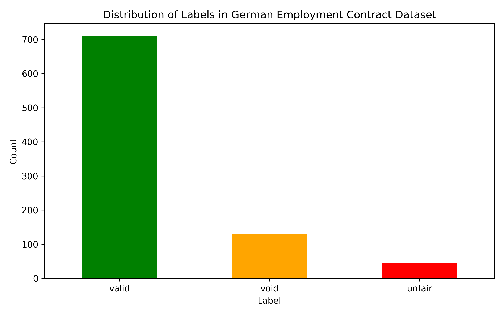
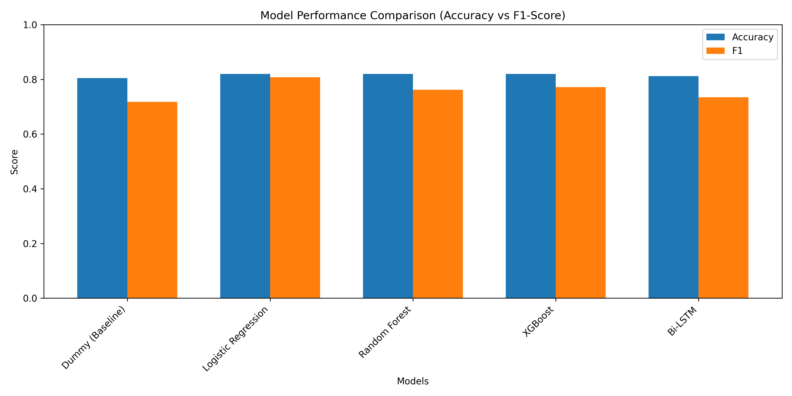
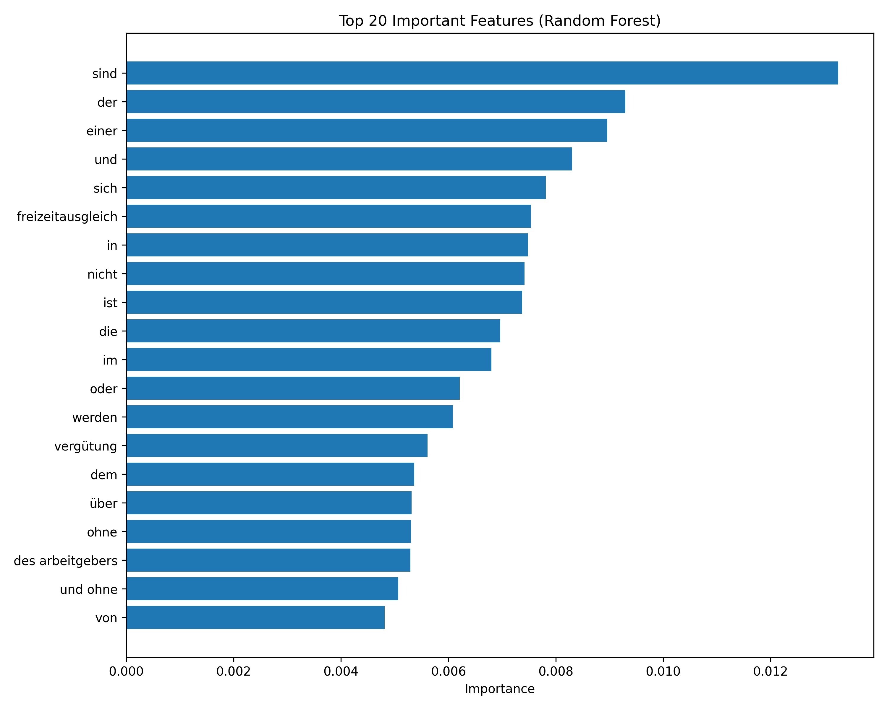
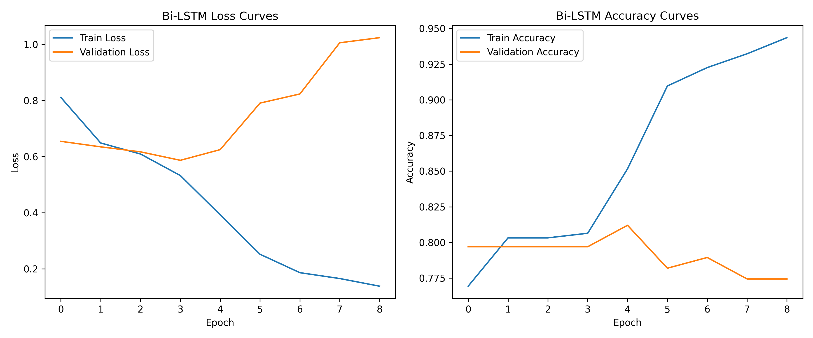

# 🛡️ ProbashiShield - AI-Powered Exploitative Clause Detection

ProbashiShield is a machine learning and deep learning pipeline designed to identify exploitatively written or void clauses within German employment contracts of Bangladeshi expatriates. 

The system is built on a dataset of 886 clauses categorized into three classes: valid (711), void (130), and unfair (45). The pipeline includes:

- **Data Processing:** Text preprocessing and feature extraction using TF-IDF (5,000 features, n-grams 1-2) for conventional methods, and Keras tokenization for deep learning models. Severe class imbalance was handled using balanced class weights.
- **Model Training:** Five models were trained and tested: Dummy Classifier, Logistic Regression, Random Forest, XGBoost, and Bi-LSTM.
- **Best Performance:** Logistic Regression proved to be the best model, achieving an accuracy of 81.95% and an F1-Score of 0.8081. This was confirmed by 5-fold cross-validation results with a mean F1-Score of 0.8161.
- **Evaluation Metrics:** The project includes detailed evaluation metrics such as confusion matrices (highlighting the difficulty in classifying the minority "unfair" class), feature importance plots, and Bi-LSTM training curves showing overfitting from epoch 5. 
- **Outputs:** All results, including the project architecture diagram and classification reports, are saved in the output folder.

## 📊 Dataset Overview

Total Clauses: **886**  
Labels: **valid**, **unfair**, **void**

<p align="center">
  
</p>

---

## 🤖 Model Performance Comparison

| Model | Accuracy | Precision | Recall | F1-Score |
|-------|----------|-----------|--------|----------|
| Dummy (Baseline) | 0.8045 | 0.6472 | 0.8045 | 0.7174 |
| Logistic Regression | **0.8195** | **0.8001** | **0.8195** | **0.8081** |
| Random Forest | 0.8195 | 0.8039 | 0.8195 | 0.7617 |
| XGBoost | 0.8195 | 0.8080 | 0.8195 | 0.7717 |
| Bi-LSTM | 0.8120 | 0.7950 | 0.8120 | 0.7346 |

🏆 **Best Model:** Logistic Regression (F1-Score: 0.8081)

<p align="center">
  
</p>

---

## 📈 Confusion Matrix (Logistic Regression)

<p align="center">
  
</p>

---

## 🔍 Important Features (Random Forest)

<p align="center">
  
</p>

---

## 📉 Bi-LSTM Training Curves

<p align="center">
  
</p>

---

## 📋 Classification Report (Logistic Regression)

*(Note: You can add your specific classification report metrics for Logistic Regression here)*

---

## 🏗️ Framework Architecture

<p align="center">
  
</p>

---

## 📁 Project Structure

```text
ProbashiShield/
│
├── data/                   # Dataset files
├── models/                 # Saved trained models
├── outputs/                # Generated plots and reports
│   ├── label_distribution.png
│   ├── model_comparison.png
│   ├── confusion_matrix.png
│   ├── feature_importance.png
│   ├── bilstm_training_curves.png
│   └── Screenshot 2026-07-14 112337.png
├── src/                    # Source code for training and evaluation
└── README.md               # Project documentation
