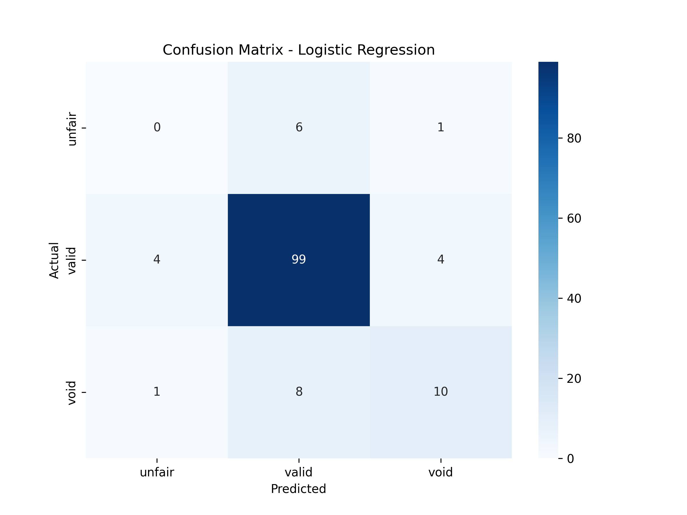

# ProbashiShield

# 🛡️ ProbashiShield - AI-Powered Exploitative Clause Detection

Machine Learning and Deep Learning models for detecting exploitative clauses in German employment contracts for Bangladeshi expatriate workers.

---

## 📊 Dataset Overview

Total Clauses: **886**  
Labels: **valid**, **unfair**, **void**

---

## 🤖 Model Performance Comparison

| Model | Accuracy | Precision | Recall | F1-Score |
|-------|----------|-----------|--------|----------|
| Dummy (Baseline) | 0.8045 | 0.6472 | 0.8045 | 0.7174 |
| Logistic Regression | **0.8195** | **0.8001** | **0.8195** | **0.8081** |
| Random Forest | 0.8195 | 0.8039 | 0.8195 | 0.7617 |
| XGBoost | 0.8195 | 0.8080 | 0.8195 | 0.7717 |
| Bi-LSTM | 0.8120 | 0.7950 | 0.8120 | 0.7346 |

🏆 **Best Model:** Logistic Regression (F1-Score: 0.8081)

---

## 📈 Confusion Matrix (Logistic Regression)

---

## 🔍 Important Features (Random Forest)

---

## 📉 Bi-LSTM Training Curves

---

## 📋 Classification Report (Logistic Regression)
*(Note: You can add your specific classification report metrics for Logistic Regression here)*

---

## 🏗️ Framework Architecture

